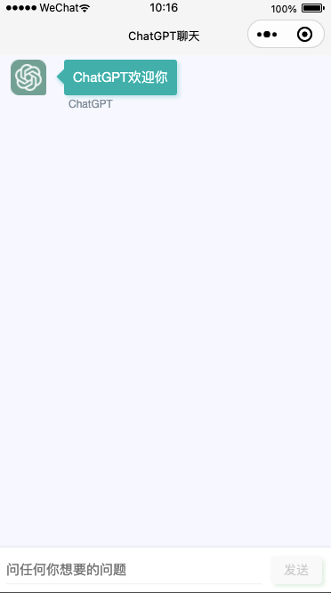

### 功能实现

- [x] chatgpt api接入聊天
- [x] 文本内容安全核验
- [x] 图片内容安全核验
- [x] 历史消息查询

### 效果预览

### 项目部署

1. 按照下方`数据表设计`新建数据集合，并设置所有数据表为访问权限为`所有用户可读，仅创建者可读写`。
2. 修改`config.js`配置文件中`CloudID`为你自己的云环境ID。
3. 上传并部署全部云函数
4. 进入云开发后台，配置上传云函数环境变量 `TZ` 为 `Asia/Shanghai`
5. `cloud-blcak-timer`需要上传触发器
6. 重新编译项目

### 数据表设计

> chat_users  聊天室用户信息表

| 字段     | 说明                     | 类型   |
| -------- | ------------------------ | ------ |
| _id      | 数据库记录唯一ID         | string |
| openid   | 用户唯一身份识别ID       | string |
| userInfo | 用户头像 昵称 地址等信息 | object |

> chat_ban_users 聊天室小黑屋信息表

| 字段        | 说明             | 类型   |
| ----------- | ---------------- | ------ |
| _id         | 数据库记录唯一ID | string |
| ban_date    | 禁言时长 单位 秒  | number |
| _createTime | 记录创建时间     | string |
| _updateTime | 记录更新时间     | string |

> chat-messags 消息记录表

| 字段        | 说明                                             | 类型   |
| ----------- | ------------------------------------------------ | ------ |
| _id         | 数据库记录唯一ID                                 | string |
| openid      | 消息发送者openid                                 | string |
| msgType     | 消息类型 目前有 1-text 2-text_answer             | number |
| content     | 消息内容 text ：对应消息内容，text_answer：chatgpt的答案 | string|
| attachment  | 消息的附件信息，用来记录一些其他的信息，比如来自chatgpt的data ｜object|
| _createTime | 消息创建时间                                     | string |

### 拓展开发

